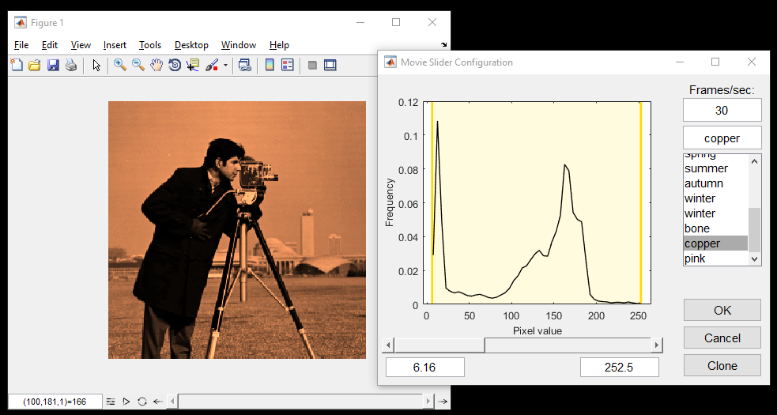

# MovieSlider
Embeddable Matlab panel for playback, scrolling, and contrast/color map adjustment of 3D movies.



## Dependencies
This software depends on the [GUI Layout Toolbox](http://www.mathworks.com/matlabcentral/fileexchange/47982-gui-layout-toolbox). Make sure to get the version appropriate for your version of Matlab (R2014b onwards vs. older).

## Description
The class MovieSlider creates a panel (that can be embedded like any other uix object) that displays the current frame of the movie tensor provided by the user, which is assumed to be 3-dimensional where the first two dimensions comprise a frame and the third dimension indexes a particular frame in the movie. GUI and keyboard controls allow automatic playback/looping as well as live scrolling through frames. There is also a button to cycle through contrast settings, and an extended configuration panel where the user can fine-tune the playback speed, color map and mapping range.

## Examples
Example usage:
```
  shape = normpdf(-2.5:0.05:2.5, 0, 1);
  tensor = bsxfun(@times, bsxfun(@times, shape, shape'), reshape(shape,1,1,[]));
  MovieSlider(tensor);
```

Various member functions exists for programatic control of some features:
```
  show(...)                     : Sets the currently displayed movie (can also be done at
                                  construction time) 
  setPlaybackFPS(playbackFPS)   : Set playback rate in frames per second
  setTitle(string)              : Sets the current title, or removes it if an empty string is
                                  provided; a cellstring can also be provided to show a different
                                  title per frame
  setFrame(index)               : Sets the current frame to the given index
  setFocusReturn(fcnReturn)     : Sets the function to call upon an 'escape' keypress
```

# Author
Copyright (C) 2016 Sue Ann Koay (koay@princeton.edu)

### Acknowledgements
The GUI icons are creations of [Olha Kozachenko](https://www.iconfinder.com/olgakozachenko) that were made public under the Creative Commons license.

